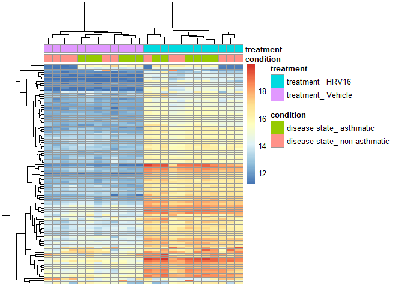

## Creating a SummarisedExperiment Object

1.  Creating ColData

``` r
library(SummarizedExperiment)
```

    ## Loading required package: MatrixGenerics

    ## Loading required package: matrixStats

    ## 
    ## Attaching package: 'MatrixGenerics'

    ## The following objects are masked from 'package:matrixStats':
    ## 
    ##     colAlls, colAnyNAs, colAnys, colAvgsPerRowSet, colCollapse,
    ##     colCounts, colCummaxs, colCummins, colCumprods, colCumsums,
    ##     colDiffs, colIQRDiffs, colIQRs, colLogSumExps, colMadDiffs,
    ##     colMads, colMaxs, colMeans2, colMedians, colMins, colOrderStats,
    ##     colProds, colQuantiles, colRanges, colRanks, colSdDiffs, colSds,
    ##     colSums2, colTabulates, colVarDiffs, colVars, colWeightedMads,
    ##     colWeightedMeans, colWeightedMedians, colWeightedSds,
    ##     colWeightedVars, rowAlls, rowAnyNAs, rowAnys, rowAvgsPerColSet,
    ##     rowCollapse, rowCounts, rowCummaxs, rowCummins, rowCumprods,
    ##     rowCumsums, rowDiffs, rowIQRDiffs, rowIQRs, rowLogSumExps,
    ##     rowMadDiffs, rowMads, rowMaxs, rowMeans2, rowMedians, rowMins,
    ##     rowOrderStats, rowProds, rowQuantiles, rowRanges, rowRanks,
    ##     rowSdDiffs, rowSds, rowSums2, rowTabulates, rowVarDiffs, rowVars,
    ##     rowWeightedMads, rowWeightedMeans, rowWeightedMedians,
    ##     rowWeightedSds, rowWeightedVars

    ## Loading required package: GenomicRanges

    ## Loading required package: stats4

    ## Loading required package: BiocGenerics

    ## Warning: package 'BiocGenerics' was built under R version 4.0.5

    ## Loading required package: parallel

    ## 
    ## Attaching package: 'BiocGenerics'

    ## The following objects are masked from 'package:parallel':
    ## 
    ##     clusterApply, clusterApplyLB, clusterCall, clusterEvalQ,
    ##     clusterExport, clusterMap, parApply, parCapply, parLapply,
    ##     parLapplyLB, parRapply, parSapply, parSapplyLB

    ## The following objects are masked from 'package:stats':
    ## 
    ##     IQR, mad, sd, var, xtabs

    ## The following objects are masked from 'package:base':
    ## 
    ##     anyDuplicated, append, as.data.frame, basename, cbind, colnames,
    ##     dirname, do.call, duplicated, eval, evalq, Filter, Find, get, grep,
    ##     grepl, intersect, is.unsorted, lapply, Map, mapply, match, mget,
    ##     order, paste, pmax, pmax.int, pmin, pmin.int, Position, rank,
    ##     rbind, Reduce, rownames, sapply, setdiff, sort, table, tapply,
    ##     union, unique, unsplit, which.max, which.min

    ## Loading required package: S4Vectors

    ## 
    ## Attaching package: 'S4Vectors'

    ## The following object is masked from 'package:base':
    ## 
    ##     expand.grid

    ## Loading required package: IRanges

    ## 
    ## Attaching package: 'IRanges'

    ## The following object is masked from 'package:grDevices':
    ## 
    ##     windows

    ## Loading required package: GenomeInfoDb

    ## Warning: package 'GenomeInfoDb' was built under R version 4.0.5

    ## Loading required package: Biobase

    ## Welcome to Bioconductor
    ## 
    ##     Vignettes contain introductory material; view with
    ##     'browseVignettes()'. To cite Bioconductor, see
    ##     'citation("Biobase")', and for packages 'citation("pkgname")'.

    ## 
    ## Attaching package: 'Biobase'

    ## The following object is masked from 'package:MatrixGenerics':
    ## 
    ##     rowMedians

    ## The following objects are masked from 'package:matrixStats':
    ## 
    ##     anyMissing, rowMedians

``` r
colData <- data.frame(sample=factor(1:6),
                      condition=factor(c("A","A","B","B","C","C")),
                      treated=factor(rep(0:1,3)))
colData
```

    ##   sample condition treated
    ## 1      1         A       0
    ## 2      2         A       1
    ## 3      3         B       0
    ## 4      4         B       1
    ## 5      5         C       0
    ## 6      6         C       1

2.  Creating RowData or RowRanges

``` r
library(EnsDb.Hsapiens.v86)
```

    ## Loading required package: ensembldb

    ## Warning: package 'ensembldb' was built under R version 4.0.5

    ## Loading required package: GenomicFeatures

    ## Loading required package: AnnotationDbi

    ## Loading required package: AnnotationFilter

    ## 
    ## Attaching package: 'ensembldb'

    ## The following object is masked from 'package:stats':
    ## 
    ##     filter

``` r
txdb <- EnsDb.Hsapiens.v86
g <- genes(txdb)
g <- keepStandardChromosomes(g, pruning.mode="coarse")
rowRanges <- g[1:10]
```

3.  Expression Data/Assay

``` r
exprs <- matrix(rnorm(6 * 10), ncol=6, nrow=10)
```

4.  Combining them into a SE Object

``` r
se <- SummarizedExperiment(assay=list("exprs"=exprs),
                           colData=colData,
                           rowRanges=rowRanges)
se
```

    ## class: RangedSummarizedExperiment 
    ## dim: 10 6 
    ## metadata(0):
    ## assays(1): exprs
    ## rownames(10): ENSG00000223972 ENSG00000227232 ... ENSG00000238009
    ##   ENSG00000239945
    ## rowData names(6): gene_id gene_name ... symbol entrezid
    ## colnames: NULL
    ## colData names(3): sample condition treated

Inspecting the object

``` r
assayNames(se)
```

    ## [1] "exprs"

``` r
mcols(se)$score <- rnorm(10)
mcols(se)
```

    ## DataFrame with 10 rows and 7 columns
    ##                         gene_id    gene_name           gene_biotype
    ##                     <character>  <character>            <character>
    ## ENSG00000223972 ENSG00000223972      DDX11L1 transcribed_unproces..
    ## ENSG00000227232 ENSG00000227232       WASH7P unprocessed_pseudogene
    ## ENSG00000278267 ENSG00000278267    MIR6859-1                  miRNA
    ## ENSG00000243485 ENSG00000243485    MIR1302-2                lincRNA
    ## ENSG00000237613 ENSG00000237613      FAM138A                lincRNA
    ## ENSG00000268020 ENSG00000268020       OR4G4P unprocessed_pseudogene
    ## ENSG00000240361 ENSG00000240361      OR4G11P unprocessed_pseudogene
    ## ENSG00000186092 ENSG00000186092        OR4F5         protein_coding
    ## ENSG00000238009 ENSG00000238009 RP11-34P13.7                lincRNA
    ## ENSG00000239945 ENSG00000239945 RP11-34P13.8                lincRNA
    ##                 seq_coord_system       symbol                       entrezid
    ##                      <character>  <character>                         <list>
    ## ENSG00000223972       chromosome      DDX11L1 100287596,100287102,727856,...
    ## ENSG00000227232       chromosome       WASH7P                             NA
    ## ENSG00000278267       chromosome    MIR6859-1                      102466751
    ## ENSG00000243485       chromosome    MIR1302-2            105376912,100302278
    ## ENSG00000237613       chromosome      FAM138A           654835,645520,641702
    ## ENSG00000268020       chromosome       OR4G4P                             NA
    ## ENSG00000240361       chromosome      OR4G11P                             NA
    ## ENSG00000186092       chromosome        OR4F5                          79501
    ## ENSG00000238009       chromosome RP11-34P13.7                             NA
    ## ENSG00000239945       chromosome RP11-34P13.8                             NA
    ##                      score
    ##                  <numeric>
    ## ENSG00000223972 -0.0157372
    ## ENSG00000227232 -0.4215794
    ## ENSG00000278267  0.4036538
    ## ENSG00000243485 -1.7423330
    ## ENSG00000237613  1.1494733
    ## ENSG00000268020  0.8586951
    ## ENSG00000240361 -0.2465119
    ## ENSG00000186092 -1.4412892
    ## ENSG00000238009 -0.6449960
    ## ENSG00000239945  0.8586777

\#Using the ranges of a SummarizedExperiment Creating a subset of the se
object based on gene location

``` r
query <- GRanges("1", IRanges(25000,40000))
se.sub <- se[overlapsAny(se, query), ]
se.sub <- se[se %over% query,]
rowRanges(se.sub)
```

    ## GRanges object with 3 ranges and 7 metadata columns:
    ##                   seqnames      ranges strand |         gene_id   gene_name
    ##                      <Rle>   <IRanges>  <Rle> |     <character> <character>
    ##   ENSG00000227232        1 14404-29570      - | ENSG00000227232      WASH7P
    ##   ENSG00000243485        1 29554-31109      + | ENSG00000243485   MIR1302-2
    ##   ENSG00000237613        1 34554-36081      - | ENSG00000237613     FAM138A
    ##                             gene_biotype seq_coord_system      symbol
    ##                              <character>      <character> <character>
    ##   ENSG00000227232 unprocessed_pseudogene       chromosome      WASH7P
    ##   ENSG00000243485                lincRNA       chromosome   MIR1302-2
    ##   ENSG00000237613                lincRNA       chromosome     FAM138A
    ##                               entrezid     score
    ##                                 <list> <numeric>
    ##   ENSG00000227232                 <NA> -0.421579
    ##   ENSG00000243485  105376912,100302278 -1.742333
    ##   ENSG00000237613 654835,645520,641702  1.149473
    ##   -------
    ##   seqinfo: 25 sequences from GRCh38 genome

``` r
assay(se.sub)
```

    ##                       [,1]       [,2]       [,3]       [,4]       [,5]
    ## ENSG00000227232 -1.2628508  0.7436645 -0.3737427  0.5433847  0.3694339
    ## ENSG00000243485 -0.6962497 -0.3440901  1.0538637 -0.1655808  0.2688650
    ## ENSG00000237613  0.5057467  0.1456817 -1.0142613  0.2486960 -0.4975704
    ##                        [,6]
    ## ENSG00000227232 -0.07401619
    ## ENSG00000243485  0.89734776
    ## ENSG00000237613  1.74287386

``` r
seqinfo(se)
```

    ## Seqinfo object with 25 sequences from GRCh38 genome:
    ##   seqnames seqlengths isCircular genome
    ##   1         248956422      FALSE GRCh38
    ##   10        133797422      FALSE GRCh38
    ##   11        135086622      FALSE GRCh38
    ##   12        133275309      FALSE GRCh38
    ##   13        114364328      FALSE GRCh38
    ##   ...             ...        ...    ...
    ##   8         145138636      FALSE GRCh38
    ##   9         138394717      FALSE GRCh38
    ##   MT            16569      FALSE GRCh38
    ##   X         156040895      FALSE GRCh38
    ##   Y          57227415      FALSE GRCh38

# Downloading SummarizedExperiment data from other studies

``` r
url <- "http://duffel.rail.bio/recount/SRP046226/rse_gene.Rdata"
#download.file(url, "rse_gene.RData")
load("~/GitHub/SummarizedExperiment-Introduction/rse_gene.Rdata")

rse <- rse_gene
```

Inspecting se object

``` r
colData(rse)[,1:6]
```

    ## DataFrame with 24 rows and 6 columns
    ##                project      sample  experiment         run
    ##            <character> <character> <character> <character>
    ## SRR1565926   SRP046226   SRS694613   SRX692912  SRR1565926
    ## SRR1565927   SRP046226   SRS694614   SRX692913  SRR1565927
    ## SRR1565928   SRP046226   SRS694615   SRX692914  SRR1565928
    ## SRR1565929   SRP046226   SRS694616   SRX692915  SRR1565929
    ## SRR1565930   SRP046226   SRS694617   SRX692916  SRR1565930
    ## ...                ...         ...         ...         ...
    ## SRR1565945   SRP046226   SRS694632   SRX692931  SRR1565945
    ## SRR1565946   SRP046226   SRS694633   SRX692932  SRR1565946
    ## SRR1565947   SRP046226   SRS694634   SRX692933  SRR1565947
    ## SRR1565948   SRP046226   SRS694635   SRX692934  SRR1565948
    ## SRR1565949   SRP046226   SRS694636   SRX692935  SRR1565949
    ##            read_count_as_reported_by_sra reads_downloaded
    ##                                <integer>        <integer>
    ## SRR1565926                      12866750         12866750
    ## SRR1565927                      12797108         12797108
    ## SRR1565928                      13319016         13319016
    ## SRR1565929                      13725752         13725752
    ## SRR1565930                      10882416         10882416
    ## ...                                  ...              ...
    ## SRR1565945                      13791854         13791854
    ## SRR1565946                      13480842         13480842
    ## SRR1565947                      13166594         13166594
    ## SRR1565948                      13320398         13320398
    ## SRR1565949                      13002276         13002276

``` r
class(rse$characteristics)
```

    ## [1] "CompressedCharacterList"
    ## attr(,"package")
    ## [1] "IRanges"

``` r
rse$characteristics[1:3]
```

    ## CharacterList of length 3
    ## [[1]] cell type: Isolated from human trachea-bronchial tissues ...
    ## [[2]] cell type: Isolated from human trachea-bronchial tissues ...
    ## [[3]] cell type: Isolated from human trachea-bronchial tissues ...

``` r
rse$characteristics[[1]]
```

    ## [1] "cell type: Isolated from human trachea-bronchial tissues"
    ## [2] "passages: 2"                                             
    ## [3] "disease state: asthmatic"                                
    ## [4] "treatment: HRV16"

``` r
rse$condition <- sapply(rse$characteristics, `[`, 3)
rse$treatment <- sapply(rse$characteristics, `[`, 4)

rowRanges(rse)
```

    ## GRanges object with 58037 ranges and 3 metadata columns:
    ##                      seqnames              ranges strand |            gene_id
    ##                         <Rle>           <IRanges>  <Rle> |        <character>
    ##   ENSG00000000003.14     chrX 100627109-100639991      - | ENSG00000000003.14
    ##    ENSG00000000005.5     chrX 100584802-100599885      + |  ENSG00000000005.5
    ##   ENSG00000000419.12    chr20   50934867-50958555      - | ENSG00000000419.12
    ##   ENSG00000000457.13     chr1 169849631-169894267      - | ENSG00000000457.13
    ##   ENSG00000000460.16     chr1 169662007-169854080      + | ENSG00000000460.16
    ##                  ...      ...                 ...    ... .                ...
    ##    ENSG00000283695.1    chr19   52865369-52865429      - |  ENSG00000283695.1
    ##    ENSG00000283696.1     chr1 161399409-161422424      + |  ENSG00000283696.1
    ##    ENSG00000283697.1     chrX 149548210-149549852      - |  ENSG00000283697.1
    ##    ENSG00000283698.1     chr2 112439312-112469687      - |  ENSG00000283698.1
    ##    ENSG00000283699.1    chr10   12653138-12653197      - |  ENSG00000283699.1
    ##                      bp_length          symbol
    ##                      <integer> <CharacterList>
    ##   ENSG00000000003.14      4535          TSPAN6
    ##    ENSG00000000005.5      1610            TNMD
    ##   ENSG00000000419.12      1207            DPM1
    ##   ENSG00000000457.13      6883           SCYL3
    ##   ENSG00000000460.16      5967        C1orf112
    ##                  ...       ...             ...
    ##    ENSG00000283695.1        61            <NA>
    ##    ENSG00000283696.1       997            <NA>
    ##    ENSG00000283697.1      1184    LOC101928917
    ##    ENSG00000283698.1       940            <NA>
    ##    ENSG00000283699.1        60         MIR4481
    ##   -------
    ##   seqinfo: 25 sequences (1 circular) from an unspecified genome; no seqlengths

``` r
seqinfo(rse)
```

    ## Seqinfo object with 25 sequences (1 circular) from an unspecified genome; no seqlengths:
    ##   seqnames seqlengths isCircular genome
    ##   chr1           <NA>       <NA>   <NA>
    ##   chr2           <NA>       <NA>   <NA>
    ##   chr3           <NA>       <NA>   <NA>
    ##   chr4           <NA>       <NA>   <NA>
    ##   chr5           <NA>       <NA>   <NA>
    ##   ...             ...        ...    ...
    ##   chr21          <NA>       <NA>   <NA>
    ##   chr22          <NA>       <NA>   <NA>
    ##   chrX           <NA>       <NA>   <NA>
    ##   chrY           <NA>       <NA>   <NA>
    ##   chrM           <NA>       TRUE   <NA>

\#Visualizing count matrix data in a SummarizedExperiment

creating dds and vsd object

<https://www.rdocumentation.org/packages/DESeq2/versions/1.12.3/topics/vst>

      This is a wrapper for the varianceStabilizingTransformation (VST) that provides much faster estimation of the dispersion trend used to determine the formula for the VST. 
      The speed-up is accomplished by subsetting to a smaller number of genes in order to estimate this dispersion trend. 

``` r
library(DESeq2)
library(stringr)
rse@colData@listData$treatment <- str_replace(rse@colData@listData$treatment,":","_")
colData(rse)$condition <- str_replace(colData(rse)$condition,":","_")

dds <- DESeqDataSet(rse, ~ condition + treatment)
```

    ## converting counts to integer mode

    ## Warning in DESeqDataSet(rse, ~condition + treatment): some variables in design
    ## formula are characters, converting to factors

    ##   Note: levels of factors in the design contain characters other than
    ##   letters, numbers, '_' and '.'. It is recommended (but not required) to use
    ##   only letters, numbers, and delimiters '_' or '.', as these are safe characters
    ##   for column names in R. [This is a message, not a warning or an error]

``` r
vsd <- vst(dds, blind = FALSE)
```

    ##   Note: levels of factors in the design contain characters other than
    ##   letters, numbers, '_' and '.'. It is recommended (but not required) to use
    ##   only letters, numbers, and delimiters '_' or '.', as these are safe characters
    ##   for column names in R. [This is a message, not a warning or an error]

creating count matrix based on conditions

``` r
library(matrixStats)
rv <- rowVars(assay(vsd))

anno.col <- as.data.frame(colData(vsd)[,c("condition","treatment")])
anno.col
```

    ##                               condition          treatment
    ## SRR1565926     disease state_ asthmatic   treatment_ HRV16
    ## SRR1565927     disease state_ asthmatic   treatment_ HRV16
    ## SRR1565928     disease state_ asthmatic   treatment_ HRV16
    ## SRR1565929     disease state_ asthmatic   treatment_ HRV16
    ## SRR1565930     disease state_ asthmatic   treatment_ HRV16
    ## SRR1565931     disease state_ asthmatic   treatment_ HRV16
    ## SRR1565932     disease state_ asthmatic treatment_ Vehicle
    ## SRR1565933     disease state_ asthmatic treatment_ Vehicle
    ## SRR1565934     disease state_ asthmatic treatment_ Vehicle
    ## SRR1565935     disease state_ asthmatic treatment_ Vehicle
    ## SRR1565936     disease state_ asthmatic treatment_ Vehicle
    ## SRR1565937     disease state_ asthmatic treatment_ Vehicle
    ## SRR1565938 disease state_ non-asthmatic   treatment_ HRV16
    ## SRR1565939 disease state_ non-asthmatic   treatment_ HRV16
    ## SRR1565940 disease state_ non-asthmatic   treatment_ HRV16
    ## SRR1565941 disease state_ non-asthmatic   treatment_ HRV16
    ## SRR1565942 disease state_ non-asthmatic   treatment_ HRV16
    ## SRR1565943 disease state_ non-asthmatic   treatment_ HRV16
    ## SRR1565944 disease state_ non-asthmatic treatment_ Vehicle
    ## SRR1565945 disease state_ non-asthmatic treatment_ Vehicle
    ## SRR1565946 disease state_ non-asthmatic treatment_ Vehicle
    ## SRR1565947 disease state_ non-asthmatic treatment_ Vehicle
    ## SRR1565948 disease state_ non-asthmatic treatment_ Vehicle
    ## SRR1565949 disease state_ non-asthmatic treatment_ Vehicle

plotting heatmap using pheatmap functions

``` r
library(pheatmap)
pheatmap(assay(vsd)[head(order(rv, decreasing=TRUE),100),],
         annotation_col=anno.col,
         show_rownames=FALSE, show_colnames=FALSE)
```

<!-- -->

``` r
sessionInfo()
```

    ## R version 4.0.4 (2021-02-15)
    ## Platform: x86_64-w64-mingw32/x64 (64-bit)
    ## Running under: Windows 10 x64 (build 19043)
    ## 
    ## Matrix products: default
    ## 
    ## locale:
    ## [1] LC_COLLATE=English_Malaysia.1252  LC_CTYPE=English_Malaysia.1252   
    ## [3] LC_MONETARY=English_Malaysia.1252 LC_NUMERIC=C                     
    ## [5] LC_TIME=English_Malaysia.1252    
    ## 
    ## attached base packages:
    ## [1] parallel  stats4    stats     graphics  grDevices utils     datasets 
    ## [8] methods   base     
    ## 
    ## other attached packages:
    ##  [1] pheatmap_1.0.12             stringr_1.4.0              
    ##  [3] DESeq2_1.30.1               EnsDb.Hsapiens.v86_2.99.0  
    ##  [5] ensembldb_2.14.1            AnnotationFilter_1.14.0    
    ##  [7] GenomicFeatures_1.42.3      AnnotationDbi_1.52.0       
    ##  [9] SummarizedExperiment_1.20.0 Biobase_2.50.0             
    ## [11] GenomicRanges_1.42.0        GenomeInfoDb_1.26.7        
    ## [13] IRanges_2.24.1              S4Vectors_0.28.1           
    ## [15] BiocGenerics_0.36.1         MatrixGenerics_1.2.1       
    ## [17] matrixStats_0.58.0         
    ## 
    ## loaded via a namespace (and not attached):
    ##  [1] httr_1.4.2               splines_4.0.4            bit64_4.0.5             
    ##  [4] assertthat_0.2.1         askpass_1.1              BiocFileCache_1.14.0    
    ##  [7] blob_1.2.1               GenomeInfoDbData_1.2.4   Rsamtools_2.6.0         
    ## [10] yaml_2.2.1               progress_1.2.2           pillar_1.6.0            
    ## [13] RSQLite_2.2.7            lattice_0.20-41          glue_1.4.2              
    ## [16] digest_0.6.27            RColorBrewer_1.1-2       XVector_0.30.0          
    ## [19] colorspace_2.0-0         htmltools_0.5.1.1        Matrix_1.3-2            
    ## [22] XML_3.99-0.6             pkgconfig_2.0.3          biomaRt_2.46.3          
    ## [25] genefilter_1.72.1        zlibbioc_1.36.0          xtable_1.8-4            
    ## [28] purrr_0.3.4              scales_1.1.1             BiocParallel_1.24.1     
    ## [31] annotate_1.68.0          tibble_3.1.1             openssl_1.4.3           
    ## [34] farver_2.1.0             ggplot2_3.3.3            generics_0.1.0          
    ## [37] ellipsis_0.3.1           cachem_1.0.4             lazyeval_0.2.2          
    ## [40] survival_3.2-10          magrittr_2.0.1           crayon_1.4.1            
    ## [43] memoise_2.0.0            evaluate_0.14            fansi_0.4.2             
    ## [46] xml2_1.3.2               tools_4.0.4              prettyunits_1.1.1       
    ## [49] hms_1.0.0                lifecycle_1.0.0          locfit_1.5-9.4          
    ## [52] munsell_0.5.0            DelayedArray_0.16.3      Biostrings_2.58.0       
    ## [55] compiler_4.0.4           rlang_0.4.10             grid_4.0.4              
    ## [58] RCurl_1.98-1.3           rappdirs_0.3.3           bitops_1.0-7            
    ## [61] rmarkdown_2.7            gtable_0.3.0             DBI_1.1.1               
    ## [64] curl_4.3                 R6_2.5.0                 GenomicAlignments_1.26.0
    ## [67] knitr_1.33               dplyr_1.0.5              rtracklayer_1.49.5      
    ## [70] fastmap_1.1.0            bit_4.0.4                utf8_1.2.1              
    ## [73] ProtGenerics_1.22.0      stringi_1.5.3            Rcpp_1.0.6              
    ## [76] geneplotter_1.68.0       vctrs_0.3.7              dbplyr_2.1.1            
    ## [79] tidyselect_1.1.0         xfun_0.22
